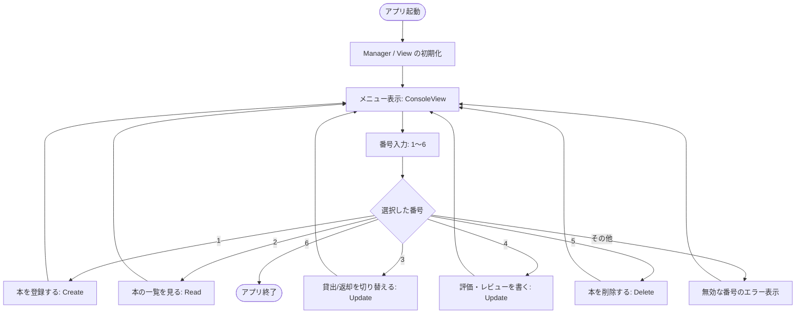
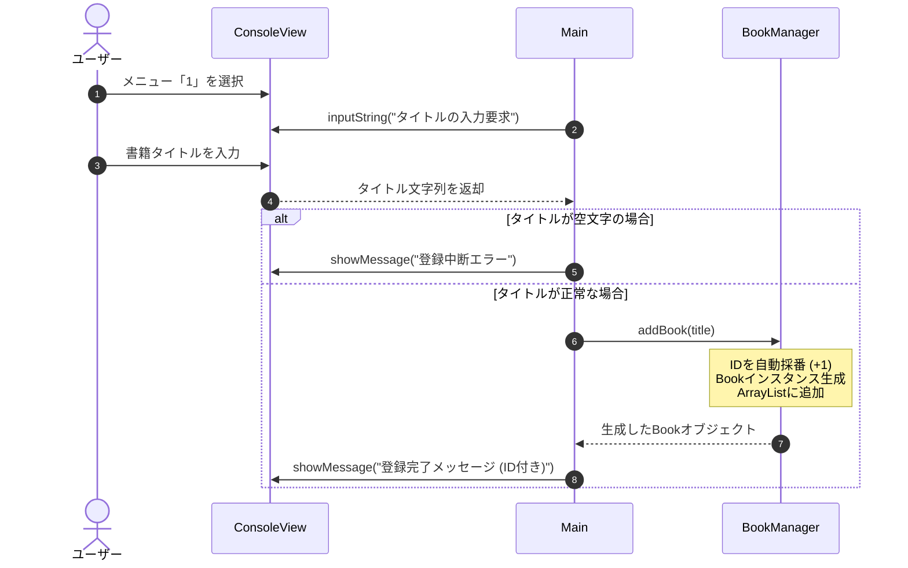
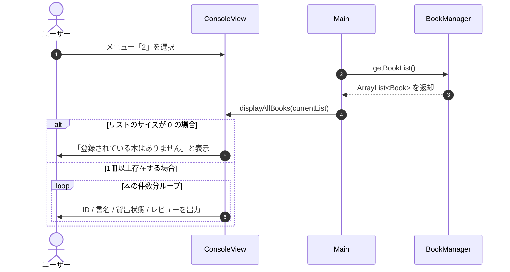
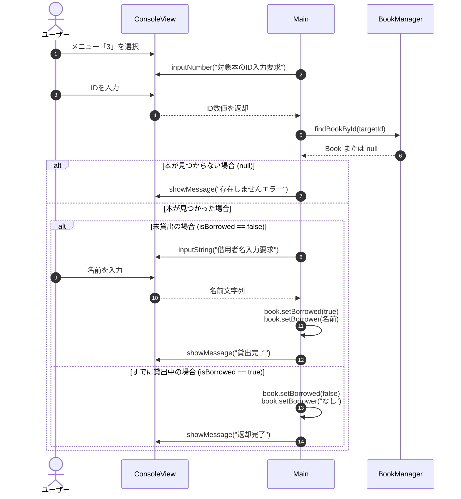
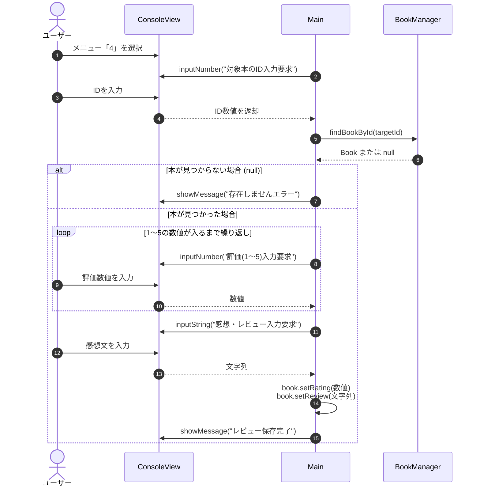
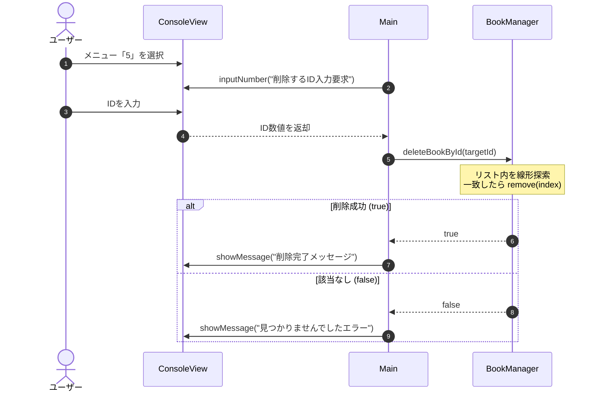

# 技術書シェア＆レビュー管理システム (CLI)

Javaの基礎構文の定着とオブジェクト指向の理解を深めるために制作した、コンソール（CUI）上で動作する書籍・レビュー管理アプリケーションです。  
テキストで学んだ制御構文、コレクション、例外処理、クラス分割を実践に落とし込むことを目的としています。

---

## 📌 主な機能 (CRUD)

テキストの定番であるCRUD（作成・読取・更新・削除）の操作を網羅しています。

- **C (Create / 登録)**: 新しい技術書のタイトルを登録（IDは自動採番）
- **R (Read / 一覧表示)**: 登録されている書籍の一覧、貸出状況、レビューの閲覧
- **U (Update / 更新)**: 
  - 書籍の貸出／返却ステータスの切り替え（借り手の名前管理）
  - 1〜5段階の評価およびレビューテキストの追加
- **D (Delete / 削除)**: 指定したIDの書籍データを削除

---

## 🛠 技術スタック・学習テーマ

- **言語**: Java (Java SE 17 / 21)
- **開発環境**: Eclipse
- **実践した主な文法・概念**:
  - **制御構文**: `while` によるメインループ、`switch-case` によるメニュー分岐、`for` ループによる線形探索
  - **コレクション**: `ArrayList` による動的なデータ管理
  - **オブジェクト指向 / カプセル化**: 
    - `private` フィールドと Getter / Setter
    - 単一責任を意識したクラス分割 (`app`, `service`, `view`, `model`)
  - **例外処理**: `Scanner` 利用時の `InputMismatchException` のハンドリングとバッファクリア

---

## 📂 クラス構成
```text
src/
├── app/
│   └── Main.java         # プログラムの起点、メインループとメニュー制御
├── service/
│   └── BookManager.java  # 本のリスト操作、検索、CRUD処理（ロジック層）
├── view/
│   └── ConsoleView.java  # 標準入出力、Scannerの制御、例外処理（画面層）
└── model/
    └── Book.java         # 本のデータ構造（タイトル、貸出状態、レビュー等））
``` 

## 手順






